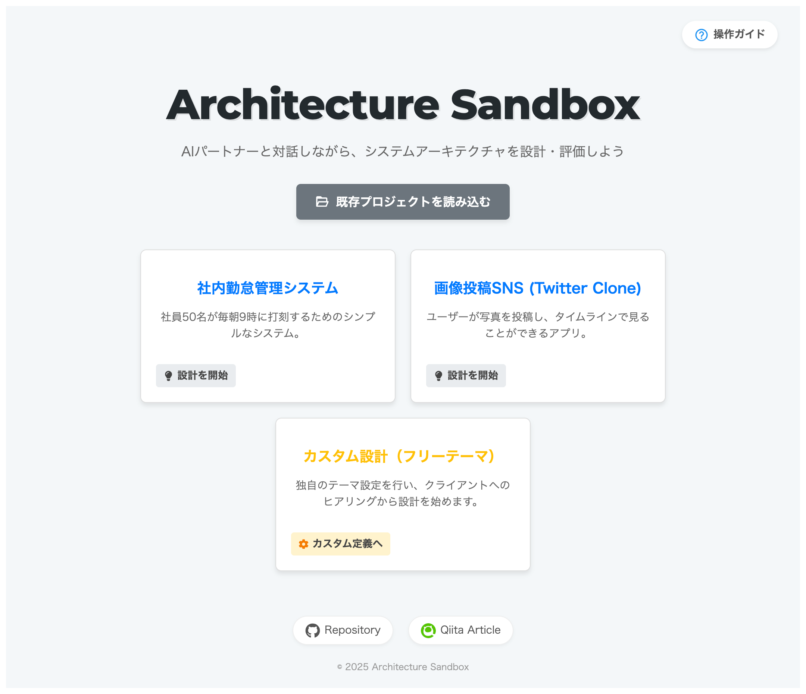
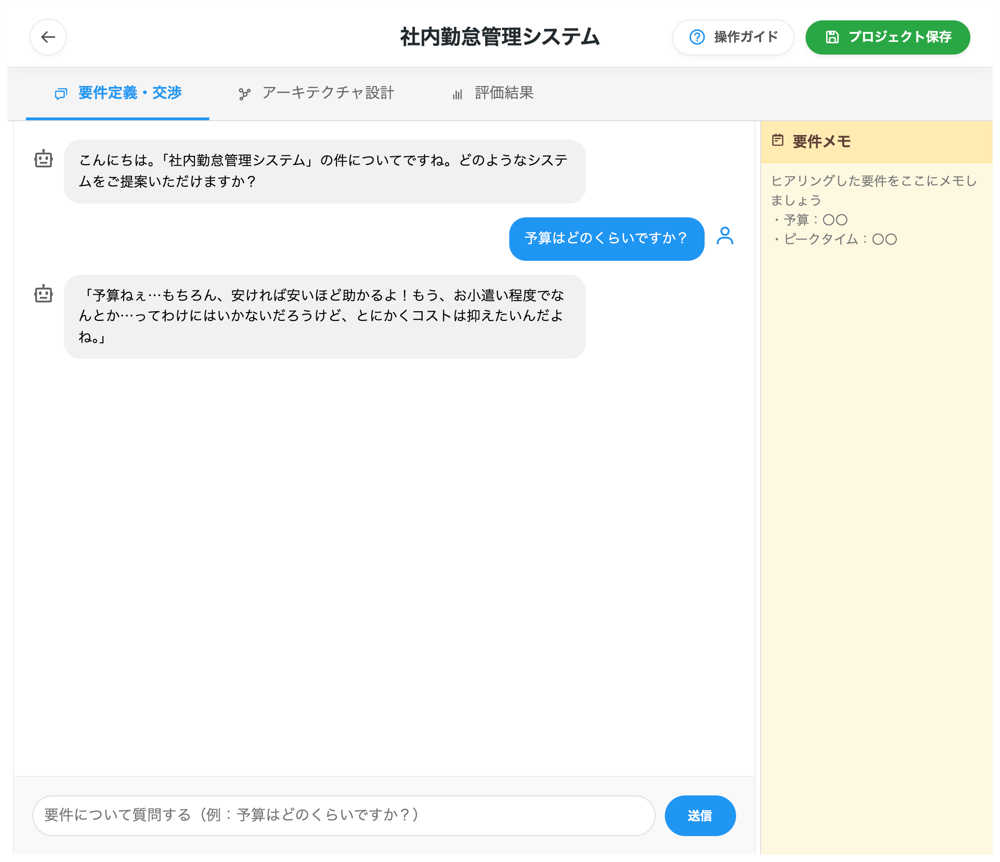
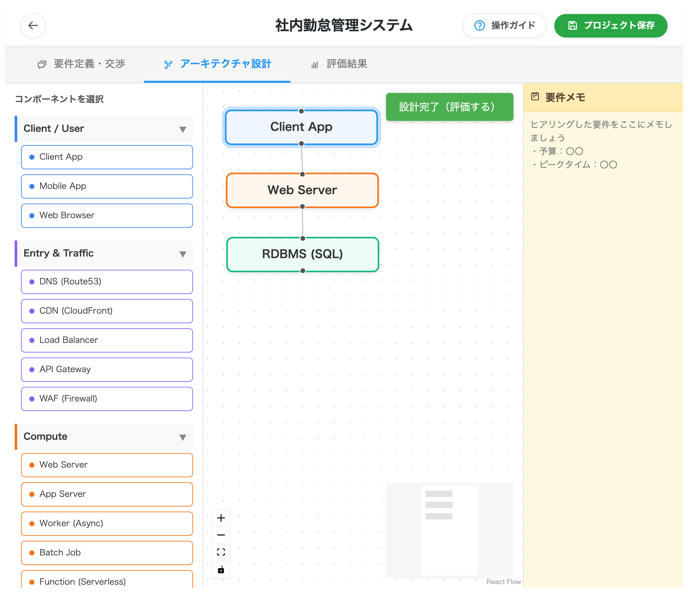
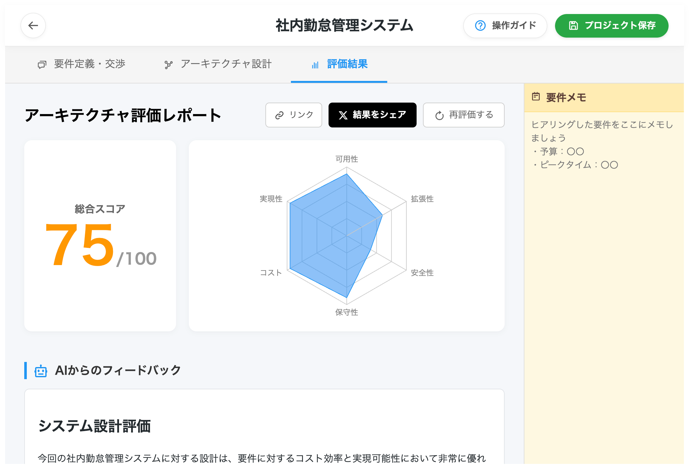

# Architecture Sandbox

**対話型システムアーキテクチャ設計練習プラットフォーム**



Architecture Sandboxは、システム設計の「要件定義」「設計」「評価」のプロセスを一気通貫で練習できるWebアプリケーションです。
AIクライアントとの対話を通じて隠れた要件を引き出し、ドラッグ＆ドロップで構成図を作成すると、AIアーキテクトが即座に採点・フィードバックを行います。

## 🚀 主な機能 (Key Features)

### 1\. 🤖 AIクライアントとの要件定義 (Negotiation)

  * **リアルな対話:** CEO（夢を語る）、CTO（堅牢性重視）、CFO（コスト重視）など、異なるペルソナを持つAIクライアントが登場。
  * **隠しパラメータ:** ユーザー数や予算などの重要な制約は最初は伏せられており、チャットでヒアリングして引き出す必要があります。



### 2\. 🖱️ ドラッグ＆ドロップ設計 (Visual Design)

  * **直感的なUI:** React Flowベースのキャンバスで、Webサーバー、DB、キャッシュ、CDNなどのコンポーネントを配置・接続。
  * **詳細設定:** 各コンポーネントに「技術選定理由」や「詳細スペック」を記述することで、AIの評価精度が向上します。



### 3\. 📊 AIによる即時評価 (Real-time Evaluation)

  * **多角的スコアリング:** 可用性、拡張性、安全性、保守性、コスト、実現性の6軸でレーダーチャート評価。
  * **具体的フィードバック:** Google Gemini 2.5 Flashを活用し、設計の改善点やリスクを具体的に指摘します。



### 4\. 🤝 共有と挑戦 (Challenge Mode)

  * **挑戦状の発行:** 自分の設計したシナリオ（要件設定）をURL化してSNSで共有可能。
  * **データ永続化:** サーバーレス構成のため、プロジェクトデータはローカルのJSONファイルとして保存・復元できます。

-----

## 🛠️ 技術スタック (Tech Stack)

コスト効率とパフォーマンスを重視した **"Ultra Low Cost"** かつ **Stateless** なアーキテクチャを採用しています。

| Category | Technology | Details |
| --- | --- | --- |
| **Frontend** | React (Vite) | TypeScript, React Flow, Recharts |
| **Backend** | Rust | Axum, Tokio, Reqwest (Async) |
| **AI Model** | Google Gemini | Gemini 2.5 Flash |
| **Infrastructure** | AWS | App Runner, S3, CloudFront (Terraform管理) |
| **Deployment** | Docker | Multi-stage build (Debian slim) |

-----

## 📂 ディレクトリ構成 (Project Structure)

```text
architecture-sandbox/
├── backend/                # Rust Axum Backend
│   ├── src/
│   │   ├── main.rs         # Entry point & Routes
│   │   ├── handlers.rs     # API Handlers (Chat, Evaluate, Shorten)
│   │   └── ...
│   └── Dockerfile          # For App Runner
├── frontend/               # React Vite Frontend
│   ├── src/
│   │   ├── components/     # UI Components (Canvas, Panels, Modals)
│   │   ├── scenarios.ts    # Preset Scenarios
│   │   └── ...
│   └── ...
├── infrastructure/         # Terraform Configurations
└── ...
```

-----

## 📖 使い方 (Usage)

1.  **シナリオ選択:** トップ画面からプリセットシナリオを選ぶか、カスタム設定で「挑戦状」を作成します。
2.  **ヒアリング:** 「要件定義・交渉」タブでAIと会話（チャット）し、予算やトラフィック要件を聞き出します。
3.  **設計:** 「アーキテクチャ設計」タブでコンポーネントを配置し、詳細を記述します。
4.  **評価:** 「評価する」ボタンを押し、AIからのフィードバックを受け取ります。
5.  **改善:** 指摘を元に設計を修正し、高得点を目指して再評価を行います。
6.  **共有:** 結果をSNSでシェアしたり、JSONファイルを保存して友人と見せ合います。

-----

## 🤝 貢献 (Contributing)

プルリクエストは歓迎します！大きな変更を加える場合は、まずIssueを開いて議論してください。

1.  Fork the repository
2.  Create your feature branch (`git checkout -b feature/AmazingFeature`)
3.  Commit your changes (`git commit -m 'Add some AmazingFeature'`)
4.  Push to the branch (`git push origin feature/AmazingFeature`)
5.  Open a Pull Request

-----

## 🔗 リンク

  * **開発者:** Morishita-mm / [X Account](https://x.com/TechMzk)
  * **Qiita記事:** [「システム設計の練習場所がない！」と嘆くのが嫌で、RustとAIで『最強の壁打ち相手』を自作した話](https://t.co/N23OaXgMSE)

-----

## 📜 ライセンス

This project is licensed under the MIT License - see the [LICENSE](https://www.google.com/search?q=LICENSE) file for details.