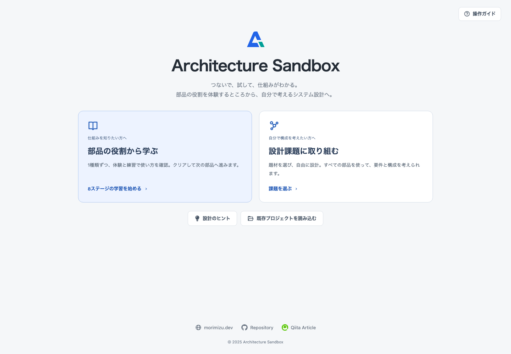
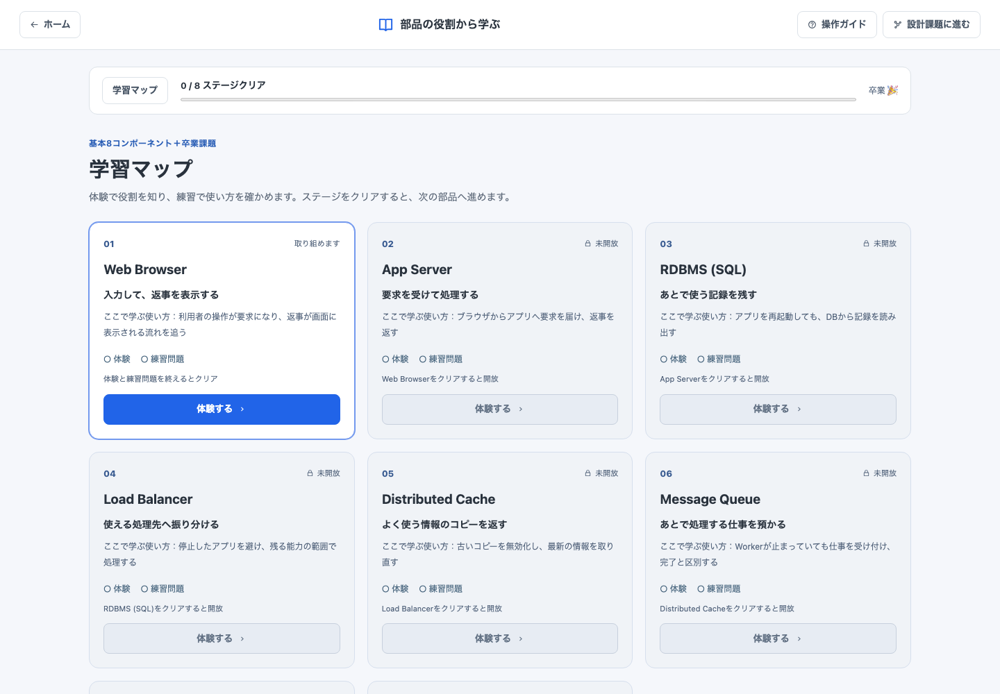
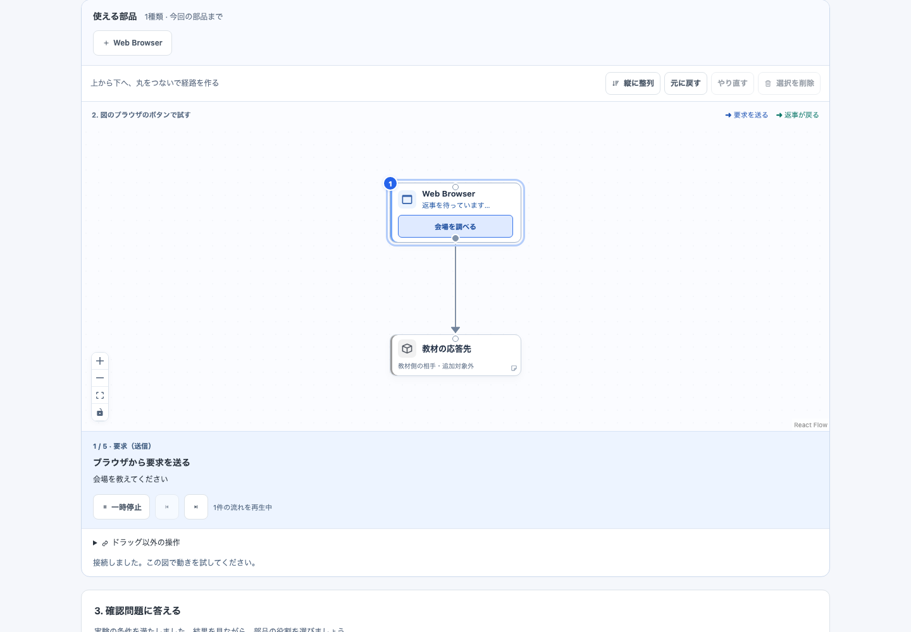
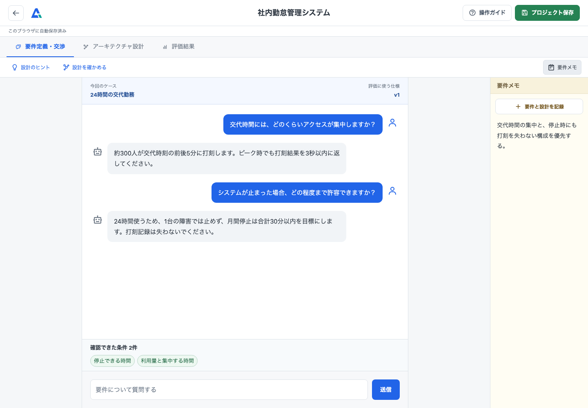
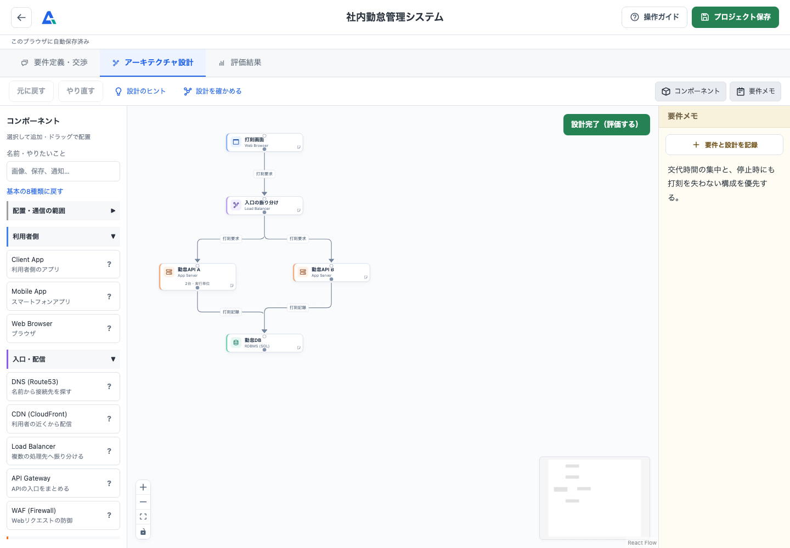
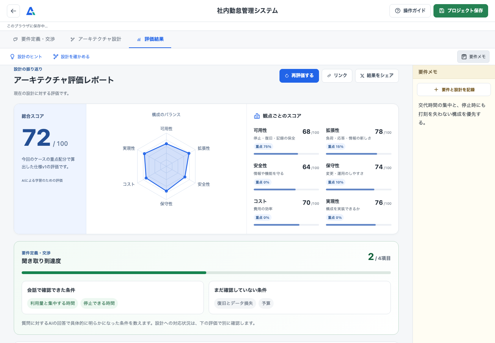

# Architecture Sandbox

**つないで、試して、理由を説明する。システム設計の体験型学習アプリ。**

[公開アプリを使う](https://sandbox.morimizu.dev) · [リリースノート](docs/RELEASE_NOTES.md) · [ケーススタディ](docs/portfolio-case-study.md)



Architecture Sandboxは、IT初学者がコンポーネントの役割から学び、要件の聞き取り、構成図の作成、AIによる振り返りまでを一つの流れで練習できるWebアプリです。経験者は入門コースを省略し、最初から設計課題へ進めます。

## 2つの学び方

### 部品の役割から学ぶ

Web Browser、App Server、RDBMS、Load Balancer、Distributed Cache、Message Queue、Worker、API Gatewayを1種類ずつ体験します。各ステージで部品を配置・接続し、データの動きを操作してから、別の場面の練習問題へ進みます。



学習済みの部品だけを使えるため、最初から32種類の選択肢に迷いません。操作と確認問題の両方を満たすと次のステージが開き、8ステージの後には学んだ部品を組み合わせる卒業課題があります。



### 設計課題に取り組む

固定シナリオまたは自由テーマを選び、次のサイクルを繰り返します。

1. AIクライアントへ質問し、利用量、停止許容、データ保持、予算などを具体化する。
2. React Flowのキャンバスに部品を置き、接続と設計理由を記録する。
3. 要件に対する構成の強み、不足、未確認事項をAI評価で振り返る。
4. 指摘を設計へ戻し、修正して再評価する。

#### 1. 要件を聞き取る

固定シナリオには、同じ題材でも重点が異なる3つのケースがあります。AIの回答で明らかになった条件は、質問と回答を根拠として記録されます。合意した仕様変更は版を進め、以後の会話と評価に引き継ぎます。



#### 2. 構成を作る

自由設計では32種類の部品を検索・配置できます。部品カード、接続点、Undo / Redo、縦方向の整列は入門コースと共通です。詳しいプロパティは任意で、部品の役割、接続、短い設計理由だけでも評価できます。



#### 3. 根拠と未確認事項を振り返る

評価は可用性、拡張性、安全性、保守性、コスト、実現性の6軸を表示します。総合点はケースごとの重点配分で算出し、レーダーチャート、聞き取り到達度、良い点、重大な不足、未確認事項を分けて示します。



AI評価は学習のための参考情報です。価格、性能、可用性を実測するものではなく、人間の専門家による最終判断の代替ではありません。評価品質の測定方法と既知の限界は[評価基準と検証記録](docs/evaluation-quality.md)にまとめています。

## 主な機能

- 基本8コンポーネントの段階式コースと卒業課題
- 全32種類を使える自由設計キャンバス
- コンポーネントごとの役割、接続例、利用場面、注意点
- 既定2テーマ×3ケースと、ガイド付き／自己定義のカスタムシナリオ
- AIクライアントとの要件交渉、条件の根拠、合意仕様の版管理
- ケースごとのアーキテクチャ特性の重みを使う6軸評価
- 聞き取り到達度と、設計の良い点・不足・未確認事項の分離表示
- ブラウザへの自動保存、JSONによる保存・復元、Undo / Redo
- PCとスマートフォン、キーボード操作への対応

## 技術構成

| 領域 | 技術 |
| --- | --- |
| Frontend | React 19, TypeScript, Vite, React Flow, Recharts |
| Backend | Rust, Axum, Tokio |
| AI | Google Gemini（既定: `gemini-3.5-flash-lite`） |
| Hosting | Cloudflare Workers Static Assets, GCP Cloud Run |
| Infrastructure | Terraform, Docker, GitHub Actions |

バックエンドはステートレスで、設計データはブラウザと利用者が保存するJSONファイルに保持します。固定シナリオの正式要件、評価の重点配分、Gemini向け指示はサーバー側で管理します。

## ローカルで動かす

必要環境はNode.js 22.18以上、Rust、Dockerです。AI通信を使わない学習コースとフロントエンドの確認は、次の手順で開始できます。

```sh
cd frontend
npm ci
VITE_API_BASE_URL=http://127.0.0.1:8080 \
VITE_APP_SHARE_URL=http://127.0.0.1:5175 \
npm run dev -- --host 127.0.0.1 --port 5175
```

AIとの会話・評価を含む構成は、ルートの`.env.example`を参照してGemini APIキーを設定し、Docker Composeを使います。

```sh
cp .env.example .env
docker compose -f compose.yaml -f compose.dev.yaml up --build
```

フロントエンドの標準検証:

```sh
cd frontend
npm test
npm run lint
VITE_API_BASE_URL=http://127.0.0.1:8080 npm run build:local
npm run test:e2e
```

README画像はビルド済みフロントエンドを起動後、次のコマンドで再生成できます。

```sh
node scripts/capture-readme.mjs
```

`CAPTURE_BASE_URL`を指定しない場合は`http://127.0.0.1:4173`を使用します。画像内の会話と評価は、再現可能な架空データです。

## ディレクトリ

```text
architecture-sandbox/
├── frontend/       # React UI、単体テスト、Playwright E2E
├── backend/        # Rust API、Gemini連携、サーバー側シナリオ
├── terraform/      # Cloudflare / GCP構成
├── scripts/        # 統合検証、受入、ドキュメント生成
└── docs/           # 設計判断、検証記録、調査用資料
```

## 検証状況と残る課題

実Geminiを使った本番受入では、2テーマ×6設計×3回の36評価が完了し、用意した重大欠陥の指摘、別解と未確認事項の区別、採点誘導の無効化を確認しています。Findyの外部AIによる12設計のクロスレビューは、観点を増やす用途には有効でしたが、正解判定や専門家の代替には使えないという結果でした。

現在も次の外部検証が必要です。

- 人間のアーキテクチャ専門家2名による独立レビュー（0 / 2名）
- 初学者5〜8名による独力完走と、別題材への学習転移の確認（0 / 5〜8名）

最新の本番状態は[現在の状態](docs/current_phase.yaml)、実AIの受入は[本番受入記録](docs/production-acceptance-2026-09-16.md)、改善項目は[UX改善チェックリスト](docs/ux-improvement-checklist.md)を参照してください。

## 関連ドキュメント

- [リリースノート](docs/RELEASE_NOTES.md)
- [プロダクト改善のケーススタディ](docs/portfolio-case-study.md)
- [設計データモデルと互換性](docs/design-model.md)
- [セキュリティレビュー](docs/security-review.md)
- [CI/CDと本番配置](docs/ci-cd.md)
- [入門コースの全画面](docs/stage-flow-captures.md)

## ライセンス

[MIT License](LICENSE) — Copyright (c) 2025–2026 Morishita-mm
