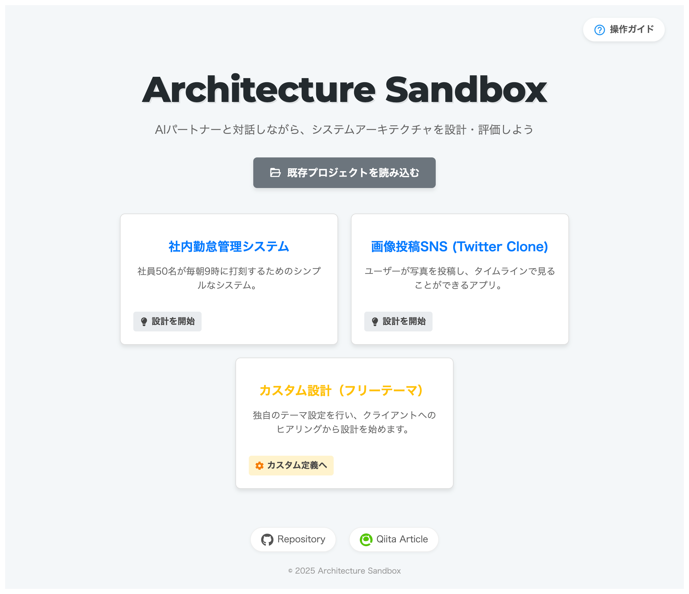
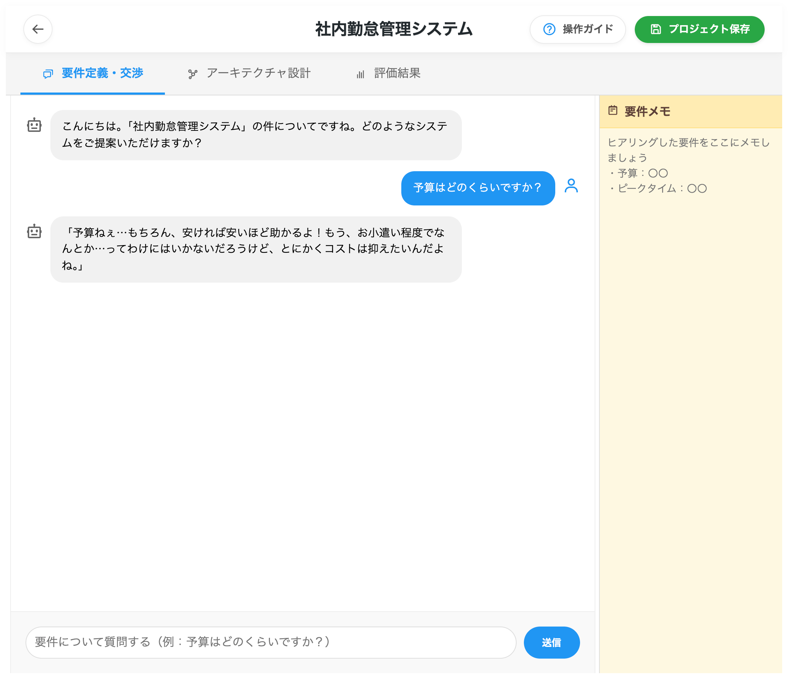
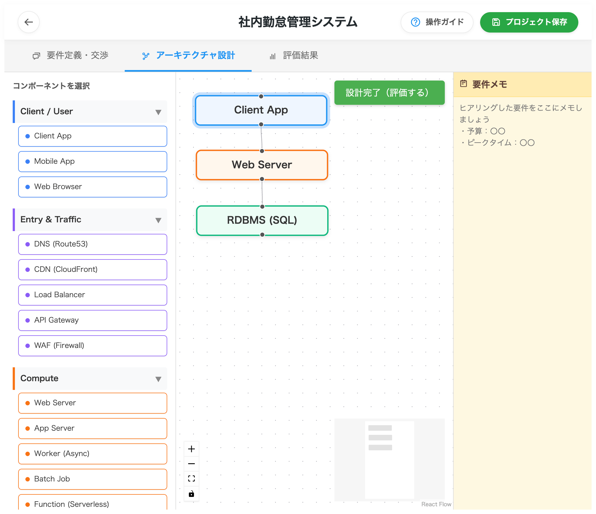
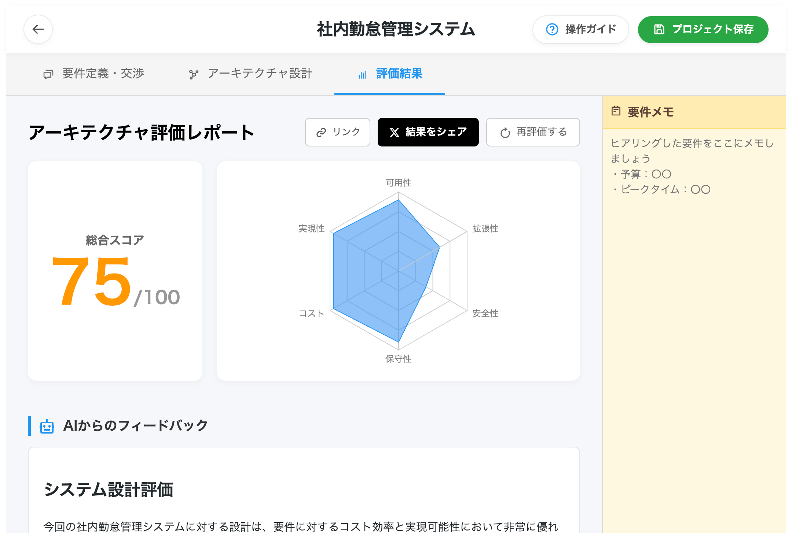

# Architecture Sandbox

**対話型システムアーキテクチャ設計練習プラットフォーム**



Architecture Sandboxは、システム設計の「要件定義」「設計」「評価」のプロセスを一気通貫で練習できるWebアプリケーションです。
AIクライアントとの対話を通じて隠れた要件を引き出し、ドラッグ＆ドロップで構成図を作成すると、AIアーキテクトが即座に採点・フィードバックを行います。

## 学習対象と方針

最初の対象は、IT自体の初学者です。部品の役割やつなぎ方を試しながら、システム全体の構成（アーキテクチャ）が、使いやすさ・止まりにくさ・情報の守り方・費用にどう関わるかを理解することを目指します。

ホームには「部品の役割から学ぶ」と「設計課題に取り組む」の2つの入口があります。初学者向けの学習コースは、少ない部品をつなぎ、操作した結果の違いから役割を学ぶ方式です。経験者は学習を経ずに設計課題へ進み、最初から全32種類を使えます。学習中もいつでも自由設計へ移れます。

入門は**基本8種類のコンポーネントを1ステージずつ学び、最後に卒業課題へ進む**構成です。

1. Web Browser — 入力し、要求を送り、返事を画面へ表示する。
2. App Server — 要求を受けて処理し、ブラウザへ返事を返す。
3. RDBMS (SQL) — アプリを再起動しても、保存した記録を読み出す。
4. Load Balancer — 必要量を見積もり、台数・振り分け・停止時の能力を比べる。
5. Distributed Cache — 読み出しを減らし、古いコピーを無効化する。
6. Message Queue — Worker停止中も仕事を受け付け、受付と完了を区別する。
7. Worker (Async) — 預かった仕事を取り出し、重複した通知を防ぐ。
8. API Gateway — 入口で利用量を制限し、見送り分を再試行する。

各ステージは「役割を体験 → 別の場面で練習 → 操作結果と理由を確認」の順です。体験だけ、回答だけではクリアせず、練習を提出して条件がそろうと次を開放します。学習マップでクリア・取り組める部品・未開放、体験と練習の進み具合、学ぶ使い方を確認できます。クリア後は復習・再挑戦でき、やり直しても獲得した開放は残ります。

全ステージの体験と練習にReact Flowの設計画面があります。自由設計と部品描画・接続点・基本の編集操作・履歴を共通化し、同じ操作をそのまま自由設計で使えます。その時点までに学んだ部品を追加・移動・接続・削除し、作った経路で要求・保存・通知を試します。未接続や迂回、停止したアプリ・Workerが結果に反映されます。ドラッグ以外の接続操作とUndo/Redo、経路を順に追う表示も利用できます。

教材の初期配置は上から下への流れにそろえ、並列の部品は同じ高さに置きます。保存済みの図も「縦に整列」で並べ直せます。自分で動かした配置は保持し、整列はUndoで取り消せます。

部品は種類別のアイコンとアクセントを添えた白いカードで表示し、名前と役割を見分けやすくしています。接続線は角を丸めた直角の経路と矢印で示し、選んだ線や学習で追っている経路を青く強調します。

8ステージをクリアすると、条件から構成を選ぶ卒業課題に進めます。比較して選んだ理由と残る課題を書き、修了一覧から図とメモを自由設計へ引き継げます。基本8種類の入門であり、全32種類を学習したとは扱いません。

教材はブラウザ内のルールで動作し、AI/APIを呼び出しません。実際の性能や安全性の検証ではなく、画面で示した仮定の比較です。仕組み・用語・得られることと負担・教材の限界を必要に応じて確認できます。

体験・練習・クリア履歴は設計プロジェクトとは別にこのブラウザへ保存し、同じ端末で再開できます。体験用・練習用の図も別々に保存します。旧ステージ版のクリア履歴を保持し、復習時は新しい図で動きを試します。旧2章／8章の記録からも移行できます。学習記録全体はプロジェクトJSONに含まれませんが、卒業課題から引き継いだ図と設計メモは通常のJSON保存・復元の対象です。

目標は、選んだ部品の役割、線で渡すもの、つなぎ方の理由を自分の言葉で説明することです。実際の初学者による理解・応用の確認は未実施です。体験・練習の仕様は[キャンバスのチェックリスト](docs/interactive-course-canvas.md)、共通化の構成は[共通エディタの記録](docs/shared-diagram-editor.md)、カード・線の外観は[外観改善の記録](docs/diagram-visual-refresh.md)、最新の配置と検証は[教材の縦配置の記録](docs/course-vertical-layout.md)と[Issue #12](https://github.com/Morishita-mm/architecture-sandbox/issues/12)、画面は[キャプチャ一覧](docs/course-canvas-captures.md)、従来の教材追加記録は[8章の拡張](docs/learning-course-expansion.md)にまとめています。

## 🚀 主な機能 (Key Features)

### 1\. 🤖 AIクライアントとの要件定義 (Negotiation)

  * **リアルな対話:** CEO（夢を語る）、CTO（堅牢性重視）、CFO（コスト重視）など、異なるペルソナを持つAIクライアントが登場。
  * **隠しパラメータ:** ユーザー数や予算などの重要な制約は最初は伏せられており、チャットでヒアリングして引き出す必要があります。
  * **任意の設計ヒント:** 作業画面の「設計のヒント」から「学ぶこと・聞くこと・図にする・振り返る」を選べます。共通の観点→設計との関係→考える問いを段階的に開き、自分のテーマへ当てはめます。ヒントはローカルの説明文で、閲覧時にAI/APIを呼び出さず、質問の送信や設計データへの書き込みもしません。
  * **要件と設計の記録:** 要件メモの「要件と設計を記録」から、条件・確認状態・根拠・関連部品・設計理由・変更前後・次に確かめることを一組にしてメモへ追加できます。確認状態は自分で選びます。記録は通常の文字として編集でき、自動保存とJSON保存にも含まれます。部品名は記録時点の名前で、後の変更へ自動追従しません。「メモに追加」する前の入力は、同じ作業を開いている間だけ保持します。記録の作成にAI/APIは使いません。



### 2\. 🖱️ ドラッグ＆ドロップ設計 (Visual Design)

  * **直感的なUI:** React Flowベースのキャンバスで、Webサーバー、DB、キャッシュ、CDNなどのコンポーネントを配置・接続。
  * **部品の学習:** 自由設計では最初から全32種類を選べ、必要に応じて基本8種類へ絞れます。日本語の目的でも検索できます。カード内の「？」からコンポーネント名を見出しに、「役割・接続例・使う場面・注意点・考える問い」をポップアップで確認できます。接続例はキャンバスと同じ配色の静的な図で、スマホでは縦に並びます。開いたまま別の部品を選び、前後の説明へ移動できます。
  * **設計理由:** 部品別の問いを手がかりに、要件をどう満たすかを記述します。操作は50段階のUndo / Redoで戻せます。キーボードから接続先を選ぶこともできます。



### 図から設計理由を確かめる（ローカル版）

「設計を確かめる」で、設定の参照切れ・未記録を確認し、該当箇所を開けます。「止まったら？」は選んだ部品全体が止まると仮定して、矢印をたどれる先の変化を表示します。「変更を比べる」は作業中の基準と現在の部品・接続の差分を表示します。AI通信は使わず、結果は任意でメモに残せます。到達性は実際の稼働・性能・データ保護の保証ではありません。

部品の設定には役割・実装方式・内部／外部・台数・切り替え・復元・条件と根拠を任意入力できます。AWSのSubnetにはVPCとAZを明示し、Security Groupは部品側で関連付けます。囲みは見た目の整理です。接続を選ぶと渡すもの・方式・同期／非同期・再試行を編集できます。スマホではキャンバスを覆わないようミニマップを表示しません。

追加設定を含む保存はJSON v3、従来の情報だけならv2。旧Base64/v2も読み込み可能です。v3は旧アプリでは読めません。詳しくは[設計モデルと互換性](docs/design-model.md)を参照してください。

### 3\. 📊 AIによる即時評価 (Real-time Evaluation)

  * **評価基準:** ローカルの新バックエンドでは6軸の等重み平均を総合点にします。未確認と明示的な欠陥、妥当な別解を分ける共通ルーブリックを定義。AIの部品参照から設定へ戻れます。意味の正しさは別途検証が必要です。[評価基準と計測手順](docs/evaluation-quality.md)
  * **多角的スコアリング:** 可用性、拡張性、安全性、保守性、コスト、実現性の6軸でレーダーチャート評価。
  * **フィードバック:** 既定モデルは `gemini-3.5-flash-lite`（`AI_MODEL_NAME`で変更可能）。AIの点数は参考情報です。採点の妥当性・再現性・学習効果は検証課題として残っています。
  * **評価との対応:** 部品・接続・設計理由を変更すると、以前の結果を「変更前の評価」と表示し、結果の共有を無効にします。配置位置だけの変更は採点対象に影響しません。



### 4\. 🤝 共有と挑戦 (Challenge Mode)

  * **挑戦状の発行:** シナリオの公開情報をURL化して共有します。構成図・会話・メモ・隠し要件はリンクに含みません。
  * **自動保存:** 送信済みの会話・メモ・構成図をブラウザ内に保存し、トップ画面から再開・削除できます。同じブラウザの利用者は保存内容を開けます。別の端末には同期されません。
  * **ファイル保存:** JSONファイルとして保存・復元できます。トップ画面の作業一覧でも、削除確認欄の「JSONファイルを保存」から直接書き出せます。ファイルは「既存プロジェクトを読み込む」から再開でき、書き出してもブラウザの作業は削除されません。旧Base64ファイルも読み込み可能です。保存ファイルは暗号化されません。ブラウザのデータ削除に備え、必要な作業はファイルにも保存してください。変更前・対応未確認の評価は書き出しに含めません。ファイルから読み込んだ評価は設計との対応を再評価で確認します。

-----

## 🛠️ 技術スタック (Tech Stack)

コスト効率とパフォーマンスを重視した **"Ultra Low Cost"** かつ **Stateless** なアーキテクチャを採用しています。

| Category | Technology | Details |
| --- | --- | --- |
| **Frontend** | React (Vite) | TypeScript, React Flow, Recharts |
| **Backend** | Rust | Axum, Tokio, Reqwest (Async) |
| **AI Model** | Google Gemini | `gemini-3.5-flash-lite`（設定可能） |
| **Infrastructure** | Cloudflare + GCP | Workers Static Assets, Cloud Run, Artifact Registry, Secret Manager |
| **Deployment** | Docker | Multi-stage build (Debian slim) |

-----

## 📂 ディレクトリ構成 (Project Structure)

```text
architecture-sandbox/
├── backend/                # Rust Axum Backend
│   ├── src/
│   │   ├── main.rs         # Entry point & Routes
│   │   ├── domain/model/   # Public API DTOs and server-side scenario requirements
│   │   └── ...
│   └── Dockerfile          # Local development
├── frontend/               # React Vite Frontend
│   ├── src/
│   │   ├── components/     # UI Components (Canvas, Panels, Modals)
│   │   ├── scenarios.ts    # Preset Scenarios
│   │   └── ...
│   └── ...
├── terraform/gcp/          # GCP Terraform (旧AWS構成はterraform直下に保全)
└── ...
```

-----

## 配置・開発

公開URLは [sandbox.morimizu.dev](https://sandbox.morimizu.dev)。Cloudflare Workers Static AssetsとGCP Cloud Runへ配置しています。公開・受入の記録は[現在の状態](docs/current_phase.yaml)、GitHub Actionsからの本番配置は[CI/CD手順](docs/ci-cd.md)、セットアップ・費用・rollbackは[移植手順](docs/migration-cloudflare-gcp.md)を参照してください。

2026-09-14以降の学習・UX改善はローカル開発中です。このREADMEの新機能説明と掲載画像、本番画面は一致しない場合があります。[改善チェックリスト](docs/ux-improvement-checklist.md)と[Issue #5](https://github.com/Morishita-mm/architecture-sandbox/issues/5)で実装済み・実測待ち・公開待ちを追跡しています。

フロントエンドだけをローカルで確認する場合:

```sh
cd frontend
npm ci
VITE_API_BASE_URL=http://127.0.0.1:8080 VITE_APP_SHARE_URL=http://127.0.0.1:5175 npm run dev -- --host 127.0.0.1 --port 5175
```

AIとの会話・評価には別途バックエンドとGeminiの設定が必要です。フロントエンドE2Eは固定応答を使い、実AIの採点品質を検証するものではありません。

[セキュリティレビュー](docs/security-review.md)に、隠し要件の管理、保存の互換性、APIの上限と公開前の残課題を記載しています。

## 📖 使い方 (Usage)

1.  **シナリオ選択:** トップ画面からプリセットシナリオを選ぶか、カスタム設定で「挑戦状」を作成します。
2.  **ヒアリング:** 「要件定義・交渉」タブでAIと会話（チャット）し、予算やトラフィック要件を聞き出します。
3.  **設計:** 「アーキテクチャ設計」タブでコンポーネントを配置し、詳細を記述します。
4.  **評価:** 「評価する」ボタンを押し、AIからのフィードバックを受け取ります。
5.  **改善:** 指摘と要件を照合し、設計理由と残る不確実性を説明できるよう修正・再評価します。採点APIはシナリオと構成図を使い、会話と要件メモは直接使いません。部品の「この部品で満たす条件と根拠」に記録した内容は、利用者の主張として部品詳細に含めます。正式条件はサーバーの設定を使い、入力から上書きしません。
6.  **共有:** 結果をSNSでシェアしたり、JSONファイルを保存して友人と見せ合います。

-----

## 🤝 貢献 (Contributing)

プルリクエストは歓迎します！大きな変更を加える場合は、まずIssueを開いて議論してください。

1.  Fork the repository
2.  Create your feature branch (`git checkout -b feature/AmazingFeature`)
3.  Commit your changes (`git commit -m 'Add some AmazingFeature'`)
4.  Push to the branch (`git push origin feature/AmazingFeature`)
5.  Open a Pull Request

-----

## 🔗 リンク

  * **開発者:** Morishita-mm / [X Account](https://x.com/TechMzk)
  * **Qiita記事:** [「システム設計の練習場所がない！」と嘆くのが嫌で、RustとAIで『最強の壁打ち相手』を自作した話](https://t.co/N23OaXgMSE)

-----

## 📜 ライセンス

このプロジェクトは[MIT License](LICENSE)で提供します。著作権表示は `Copyright (c) 2025-2026 Morishita-mm` です。依存パッケージには、それぞれのライセンスが適用されます。

## 改善の記録と未実施の検証

- [改善チェックリスト](docs/ux-improvement-checklist.md) / [GitHub Issue #5](https://github.com/Morishita-mm/architecture-sandbox/issues/5)
- [AI評価の実測](docs/evaluation-runs/2026-09-15/README.md) / [Issue #13](https://github.com/Morishita-mm/architecture-sandbox/issues/13): Gemini 32要求の結果と修正。専門家比較・品質受入は進行中
- [ケーススタディ](docs/portfolio-case-study.md): 問題・判断・実画面・検証した範囲と限界
- [初学者テスト台本](docs/usability-study.md): 独力完走・説明・別題材への応用。実施前
- [公開前チェック](docs/local-release-handoff.md): 実AI・専門家・実利用検証と公開判断をローカル実装から分離
