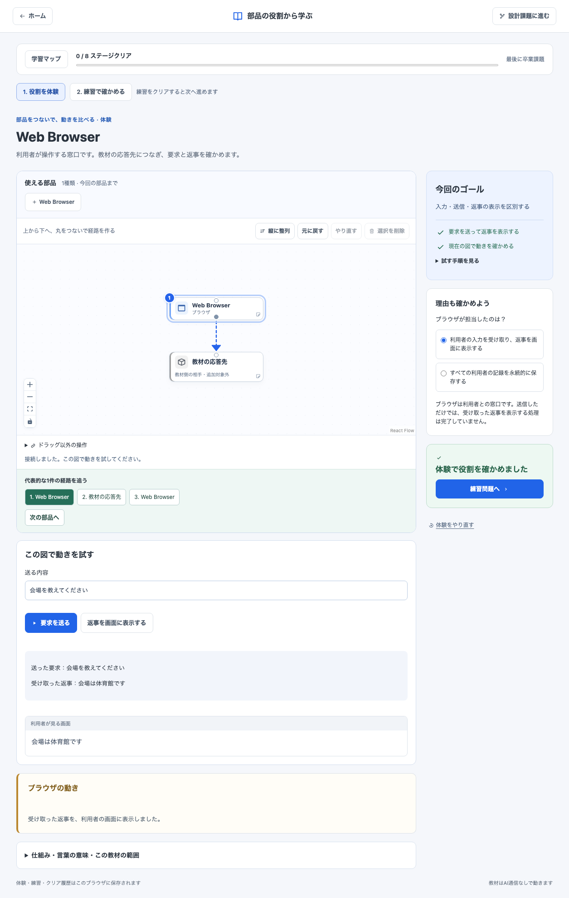
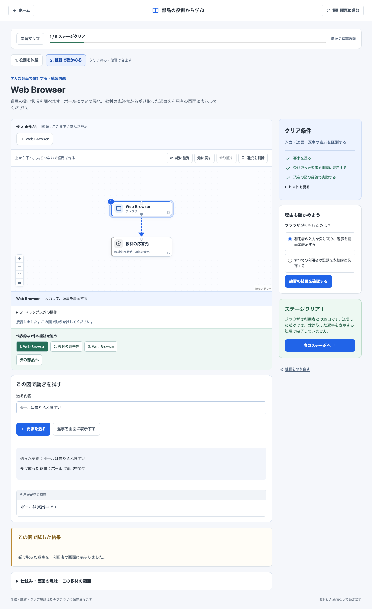
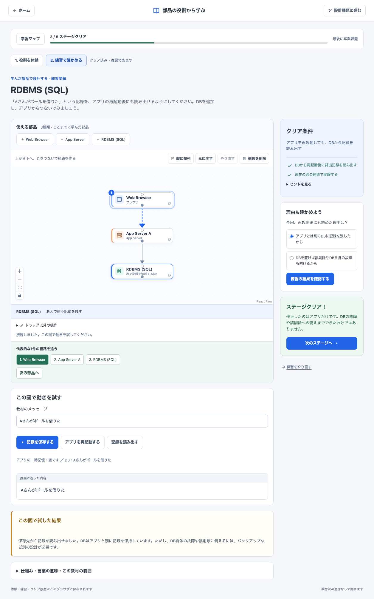
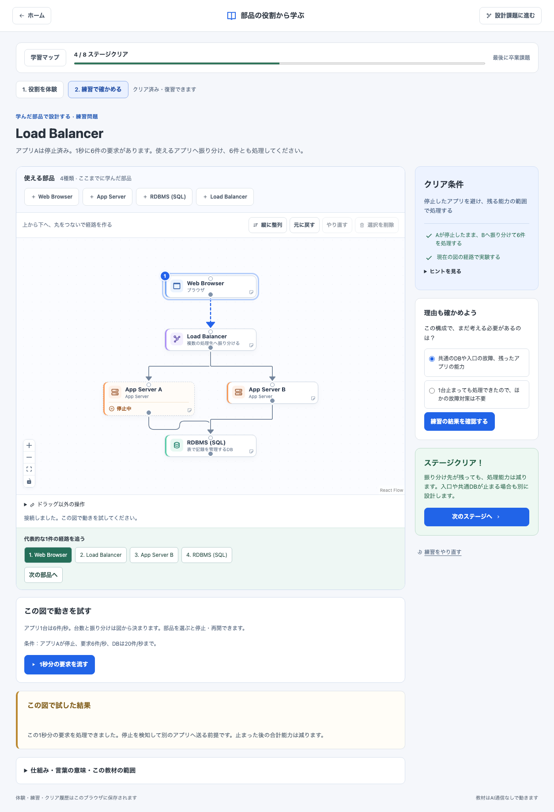
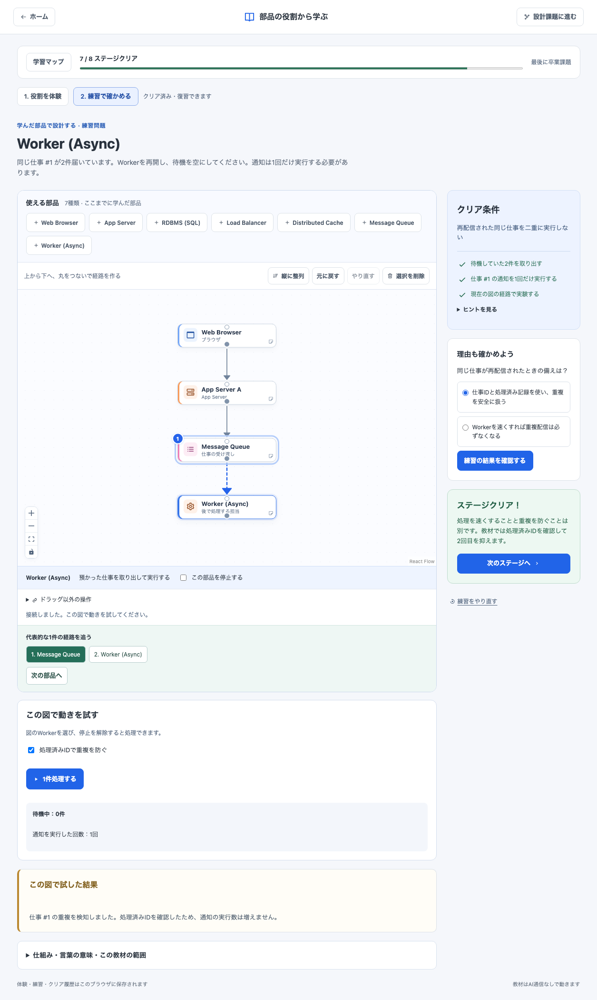
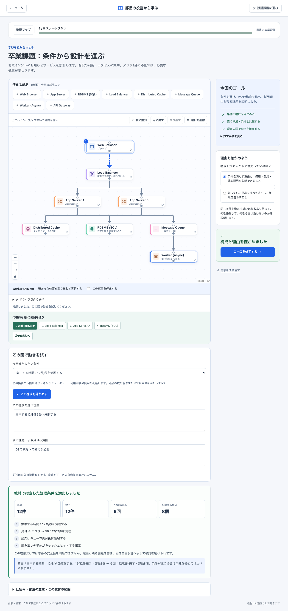
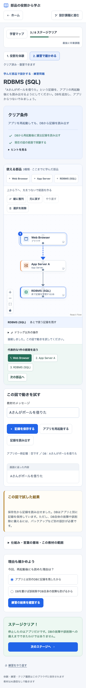
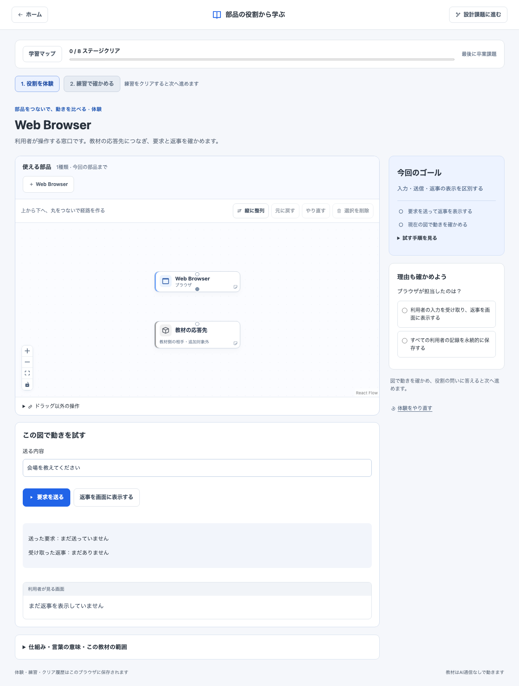
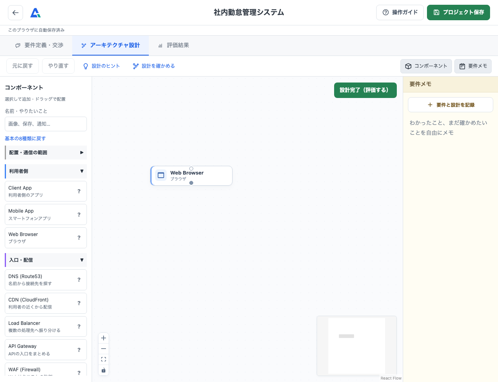

# 体験・練習キャンバスの画面

2026-09-15のローカル実装。共通化（Issue #10）、カード・線の改善（Issue #11）、教材の縦配置（Issue #12）後に撮り直した画面です。実際に図を操作して、体験→練習→次の部品→卒業課題へ進んだキャプチャです。ステージが進むと使える部品が増えます。操作後の画面を掲載しているため、初期状態の図とは異なります。

## 1. Web Browserの体験：つないで送信し、返事を表示

## 2. Web Browserの練習：自分で追加・接続してクリア

## 3. DBの練習：保存・再起動・読み出しを確認

## 4. Load Balancerの練習：停止中のAを避けてBへ送る

## 5. Workerの練習：同じ仕事の通知を1回に抑える

## 6. 卒業課題：学んだ部品を組み合わせて比較する

## 7. スマホでのDBの練習

PCは1255×963、スマホは390×844の全ページキャプチャ。スマホは拡大・縮小と「ドラッグ以外の操作」で図を操作できます。実利用での理解・操作のしやすさは、ユーザー確認と初学者テストで調整します。

仕様: [キャンバスのチェックリスト](interactive-course-canvas.md)。最新検証: [教材の縦配置の記録](course-vertical-layout.md)。共通化の構成は[共通エディタの記録](shared-diagram-editor.md)、以前の固定UIの画面は[前回の記録](stage-flow-captures.md)に保存しています。

## 8. 同じWeb Browserの表示を比較

学習と自由設計は、同じ部品コンポーネント・上下の接続点・選択表示を使用します。画面構成とキャンバスの大きさは用途に合わせています。

