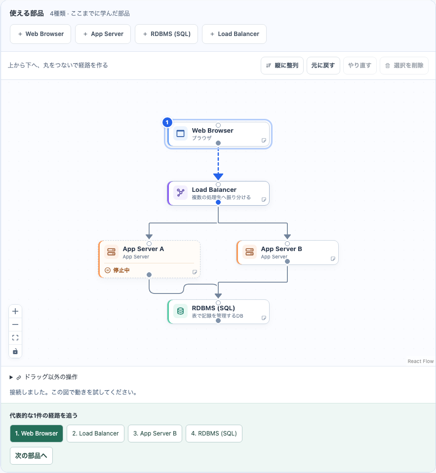

# 教材の部品配置を上から下へそろえる

進捗: **4 / 4項目をローカル実装・自己検証済み**。

2026-09-15。横長の共通カードと上下の接続点に合わせて、体験・練習・卒業課題の図を縦方向で読みやすくする。

- [x] LAYOUT-01 初期配置とボタン追加を、入口→処理→保存・キュー→Workerの順に整理。同じ役割の分岐は同じ高さに置く。
- [x] LAYOUT-02 保存済みの図を「縦に整列」で並べ直せるようにし、元に戻す・やり直す・再読込を確認する。
- [x] LAYOUT-03 自分で動かした配置とドロップ位置を保持。接続・停止・実験結果・学習履歴を変更しないことを確認する。
- [x] LAYOUT-04 PC／タッチでコースを完走し、画像・チェックリスト・Issueを更新する。

ローカル開発。push・PR・公開は行わない。関連: #11、#10、#9、親 #5。後続PRで関連付ける。

## 配置の方針

体験・練習・見積もり・卒業課題で同じ配置関数を使う。ブラウザ、入口、アプリ、保存先やキュー、Workerを上から下へ置く。複数のアプリと保存先は同じ高さで分岐させ、Workerはキューの下へ置く。今回追加する部品の段を初めから空けておき、ボタンで追加すると役割に合う位置へ入る。

初期の並びを保っている図では、追加時も全体を整える。自分で動かした図では既存の位置を保持し、追加する部品だけ空いた場所に置く。ドラッグで指定した追加位置はそのまま使う。部品の追加と、それに伴う配置調整は一度のUndoで取り消せる。

以前に保存した図は読み込んだだけでは並べ直さない。「縦に整列」で明示的に並べ直せる。位置の変更だけを履歴へ追加し、接続先・停止・実験・回答・クリア履歴を保持する。最初の教材の応答先は固定位置を維持する。

描画・部品・接続点・線は既存の共通実装を使う。教材側の配置だけを調整し、自由設計の配置や保存形式を変えない。上下の段数に合わせてキャンバスの高さを確保する。整列は役割に沿った配置で、接続を正解へ書き換える機能ではない。

## 検証記録

- frontend単体 **104 / 104成功**。初期図と追加部品の縦配置、並列アプリの間隔、旧図の整列と状態保持、固定教材、手動配置・ドロップ位置の保持を追加3件で確認。
- 全E2Eの初回は **66成功・追加2件失敗**。追加テストに体験完了の前提が欠けていて、既存の進行制御によって練習ではなく学習画面が開いていた。テストの前提を修正し、追加2件はPC／タッチとも成功。アプリの進行条件は変更していない。
- 最終の整列・追加時Undoと全コースの対象 **6 / 6成功**。全8ステージ＋卒業＋自由設計への引き継ぎ、保存・復元、整列だけでは実験結果や学習記録が変わらないことを確認。合計 **68件のE2Eを確認済み**。教材API要求は0件。
- `npm run lint`（警告なし）、`npx tsc -b`、本番用build、`git diff --check`成功。buildのAPI originは既存CIと同じfixture設定。最終E2Eでも同じアプリビルドを使用。
- PC 1255×963とタッチ390×844の実画面で縦の流れ、分岐と合流、停止表示、操作行の折り返し、ページの横はみ出しがないことを確認。画像を更新。
- 実利用による読みやすさ・学習効果、backend・実AI・本番は今回検証していない。従来の実測・実利用・公開に関する残り5項目は未完了。

対象: `codex/learning-ux-local`、base `e0ac3af`＋未コミット差分。変更されたfrontend/backend/scriptsと評価fixtureのパス・内容をソート順にNUL区切りで集計したSHA-256: `69e2975ce30325a1d40b3e8bdf81a310c4dde6d50110193921b23c4763b173cf`（88ファイル）。

## 更新した画面

[スマホのキャンバス](images/course-canvas/mobile-vertical-canvas.png) / [学習フロー全体のキャプチャ](course-canvas-captures.md)

関連Issue: [#12](https://github.com/Morishita-mm/architecture-sandbox/issues/12)、[#11](https://github.com/Morishita-mm/architecture-sandbox/issues/11)、親[#5](https://github.com/Morishita-mm/architecture-sandbox/issues/5)。後続PRは `Closes #12`、`Closes #11`、`Closes #10`、`Closes #9`、`Closes #8`、`Closes #7`、`Closes #6`、`Refs #5`。IssueはOPENを維持する。
