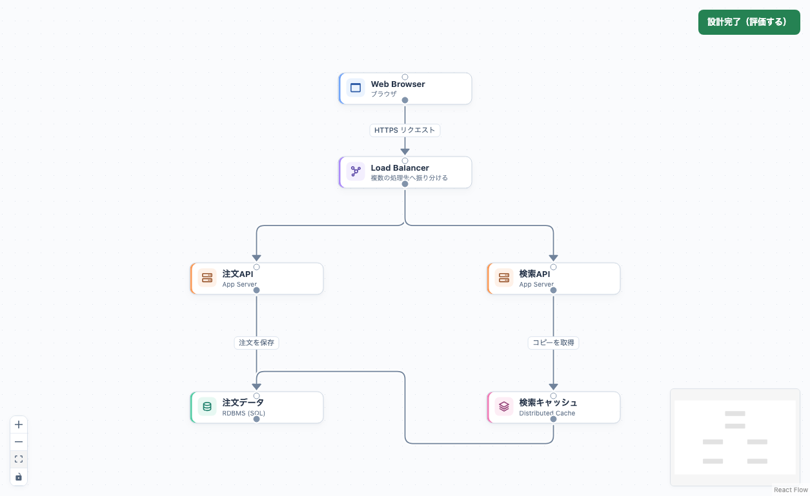

# 部品カードと接続線の見た目を整える

2026-09-15。共通化した図の描画を改善し、自由設計と学習の両方に反映する。部品名、種類、状態の優先度を整理し、接続線を追いやすくする。

進捗: **4 / 4項目をローカル実装・自己検証済み**。

続く教材の縦配置と最新検証（104単体・68 E2E）は[縦配置の記録](course-vertical-layout.md)、[Issue #12](https://github.com/Morishita-mm/architecture-sandbox/issues/12)を参照。以下はカードと線を改善した時点の記録。

- [x] VISUAL-01 白を基調に、種類別アイコンとアクセント色、内部の副題、選択・停止の状態表示を整える。
- [x] VISUAL-02 角を丸めた直角の線、交差部の白い縁、矢印・選択・学習経路の見え方を整える。
- [x] VISUAL-03 既存の接続操作・保存形式・進捗を維持し、PC／タッチ・狭い配置・長い名前で確認する。
- [x] VISUAL-04 自由設計と学習の実画面、チェックリスト、関連Issueを更新する。

今回はローカル開発。公開・push・PRは行わない。関連: #10、#9、親 #5。後続PRで関連付ける。

## 変更内容

- 共通の`CustomNode`を白いカードに変更。名前を太字、役割・元の種類を小さな副題にし、種類別のアイコンと左端のアクセントで見分ける。既存のカスタム色はアクセントとアイコンに使い、本文の背景は白を保つ。
- 選択と学習経路は青い枠、停止はアイコンと「停止中」の表示で区別。メモ・固定教材・設計設定の表示、上側の入力と下側の出力を維持する。接続点の操作領域はPCで20px、タッチで28px。
- 共通の`DiagramEdge`で角を丸めた直角の線、白い縁取り、読みやすい矢印とラベルを描く。逆向きの線は部品の外側を通る候補を比較して、部品への重なりを減らす。線の形や強調色は表示時だけ計算し、保存データには追加しない。
- カードの基準寸法を一か所で管理。グループ内へ追加した部品が収まるよう拡張幅も修正。全体表示の余白と倍率を共通化し、戻り方向の線も見切れにくくする。
- 見た目の共通実装を自由設計・学習・練習で使用し、画面別のカードや線を増やしていない。依存パッケージの追加なし。

既存の部品位置や接続先は変更しない。線の経路調整は限られた候補の比較であり、複雑な図の交差をすべて取り除く自動配置ではない。

## 自己検証（2026-09-15）

- frontend単体 **101 / 101成功**。追加2件で上向きの線の経路・障害物回避と入力データの保持を確認。
- 最終アプリビルドのPlaywright **66 / 66成功**。追加3件でPC／タッチのアイコン・線・キーボードによる接続設定・JSON保存・グループ内への追加を確認。全8ステージ＋卒業＋自由設計への引き継ぎ、編集履歴、進捗、既存の保存・評価・モーダル保護も成功。教材E2EのAPI要求 **0件**。
- `npm run lint`（警告なし）、`npx tsc -b`、本番用build、`git diff --check`成功。buildのAPI originは既存CIと同じfixture設定を使用。
- 画面テストで、線をキーボードで選んでEnterを押しても設定が開かない既存の不具合を発見。存在しないDOM属性への依存を解消し、共通の線が持つIDを使用して修正した。
- PC 1255×963とタッチ390×844の実画面を確認。長い日本語・英語の名前の折り返し、濃色・白の指定色でも本文が読めること、ページの横はみ出しがないことを確認。学習画面のキャプチャも更新。
- backend・実AI・本番・初学者による実利用は今回再検証していない。従来の実測・実利用・公開に関する5項目は未完了のまま。

対象: `codex/learning-ux-local`、base `e0ac3af`＋未コミット差分。変更されたfrontend/backend/scriptsと評価fixtureのパス・内容をソート順にNUL区切りで集計したSHA-256: `bc6feb13809f3c62e7c618513ec52daaf8f09670dd43911966073fe58143c8b7`。87ファイルを集計。最終E2E後の変更は文書・画像のみ。

## 実画面

自由設計で部品を配置・接続した例。教材側も同じカードと線を使う。

[PC画面](images/diagram-visual-refresh/polished-desktop.png) / [スマホ画面](images/diagram-visual-refresh/polished-mobile.png) / [更新した学習フローの画面](course-canvas-captures.md)

関連Issue: [#11](https://github.com/Morishita-mm/architecture-sandbox/issues/11)、[#10](https://github.com/Morishita-mm/architecture-sandbox/issues/10)、親[#5](https://github.com/Morishita-mm/architecture-sandbox/issues/5)。後続PRは `Closes #11`、`Closes #10`、`Closes #9`、`Closes #8`、`Closes #7`、`Closes #6`、`Refs #5`。IssueはOPENを維持する。
