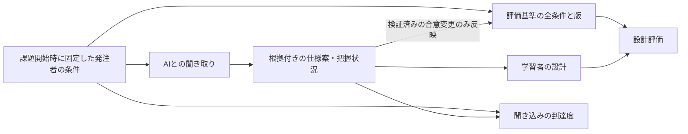

# シナリオの条件・聞き取り・設計評価をつなぐ実装方針案

2026-09-16 / [Issue #19](https://github.com/Morishita-mm/architecture-sandbox/issues/19)。聞き取りと設計をつなぐ方針に、会話と独立した発注者の条件・題材ごとの項目と数値の決め方を追加。聞き取った項目だけを評価基準にすると、聞き漏らした条件が消えてしまうため、基準の全体と学習者の把握状況を分ける。

## 実装状況

この方針の最初の提供範囲を実装した。既定2テーマでは開始時にサーバー定義の3ケースから1つを選び、ケースID、合意済み変更ID、仕様版をJSON保存・共有・再開・会話・評価で固定する。AIが返せる変更案はサーバーに登録した候補IDだけで、提案文だけでは正式条件を変更しない。利用者が差分を確認して確定したときだけ仕様版を進め、評価はその版の条件を使う。

総合点はケースごとの重点配分でサーバーが再計算する。既存の6軸レーダーチャートは残し、各軸の重点比率と評価対象の仕様版を表示する。カスタム課題は従来どおり、サーバー管理テンプレートまたは自己設定仕様を使い、既定ケースのランダム選択や交渉候補を混ぜない。未実装なのは、回答本文が正式条件と矛盾した場合の自動検出と、専門家によるケース値・配点の妥当性確認である。

## 現状と問題

実装前の`EvaluationRequest`は題材・部品・接続のみを受け取り、会話履歴や要件メモは受け取らなかった。発注者役と設計の評価役はサーバーの同じ事前設定の要件を参照していたが、会話で追加・具体化・調整した仕様を採点条件へ反映する仕組みがなかった。現在はサーバーが検証した合意変更IDと仕様版を評価入力へ含める。会話全文や自由メモを正式条件として解釈する方式にはしていない。

サーバーの要件は利用者数・トラフィック・停止許容・予算等の文章であり、項目別の到達度や交渉範囲は定義していない。自由課題も現在は難易度に対応する共通条件を使う。テーマ固有の条件をAIが会話で補っても、そのまま新しい隠し採点条件にはできない。

## 最優先：発注者の条件を固定し、聞き取った仕様と照合する

サーバー側に、その課題で必要な条件の全体を開始時点で固定する。その上で会話を根拠に学習者が把握した仕様案を整理する。両者を照合すれば聞き込みの不足がわかり、構成を条件全体と照合すれば設計への対応がわかる。会話で合意した変更は許可範囲を検証して基準の新しい版へ反映する。前案の「確定仕様」は、聞けた項目だけの一覧ではなく、この条件全体を引き継ぐ必要がある。

条件IDで、発注者の条件・仕様案・会話・設計の根拠を対応させる。必須条件の母数は会話に出た項目数で変えない。会話全文だけを採点AIへ渡し、採点のたびにAIが合意内容を解釈し直す方式は採らない。

## 題材ごとの項目と数値をどう決めるか

「共通の項目辞書＋題材のテンプレート＋整合した条件セット」で管理する。全課題へ同じ数値欄を要求せず、AIに自由な隠し条件を毎回作らせない。項目辞書は単位や意味を揃えるためのもので、全項目を必須にするものではない。

### 何を項目にするか

作者が最初に主要な利用場面と学ばせたい判断を定める。その判断を変える条件を選び、利用者・利用操作・負荷・保存・応答・鮮度・停止と復旧・安全性・予算と運用などの辞書から組み合わせる。数値だけでなく「他人の記録を見せない」「同じ席を二重に確定しない」のような条件も持つ。

| 題材の型 | 主に確認する条件の例 | 学んでほしい判断の例 |
| --- | --- | --- |
| 勤怠・社内業務 | 利用人数、始業時の集中、記録の保存期間、許される停止時間、閲覧権限、運用人数 | 小規模でも記録を守る。必要以上に構成を複雑にしない |
| 写真の投稿・閲覧 | 閲覧と投稿の量、画像の大きさ、保存期間、表示までの時間、投稿反映の遅れ | 保存・配信・処理をどう分けるか。キャッシュや非同期処理の利点と制約 |
| 速報・会話 | メッセージ量、同時接続、相手に届くまでの時間、再接続時の扱い | 処理量に加えて、情報が届く速さを重視する |
| 予約・注文 | 同時の申込み、在庫の扱い、重複受付、失敗後の再試行、記録の保存 | 速さだけでなく、競合や重複で誤った結果を作らない |

同じSNSでも「きれいな写真を快適に見る」と「今の発言をすぐ届ける」でテンプレートの重点を変える。課題名や発注者役の肩書きだけから数値・重みを決めない。重みは利用目的と条件に結び付けて版管理し、必須条件への違反を別の高得点で隠さない。

### 数値の範囲を決める手順

1. **教えたい判断を決める。** 例えば、読み取りの多さとキャッシュ、処理待ちの許容とキュー、停止条件と冗長化の関係を選ぶ。特定の部品を置くことだけを正解にしない。
2. **小規模・成長中などの条件セットを人が用意する。** 最初は既存の勤怠と画像SNSについて、各2〜3セット、主要条件5〜8項目程度を出発点とする案。実サービスの標準値ではなく、レビューする教材用の仮定として扱う。難易度は負荷の大きさだけでなく、条件の数・対立・説明の深さで決める。
3. **入力値と計算で求める値を分ける。** 利用者数、利用頻度、集中する時間幅などを入力にし、操作件数や必要な保存量を導く。DAUと秒間要求数、保存量と保存期間を独立に乱数で決めない。ピークは平均だけから決めず、集中の仮定を付ける。
4. **条件セットを具体的な設計で検証する。** 境界の値、負荷の増加、障害時も含めて、筋の通る構成・別の妥当な構成・条件に反する構成を比較する。題材の目的に対して矛盾や達成不能な組合せがないか、専門家のレビューも行う。例の構成は学習用の比較であり、実性能の実証ではない。
5. **妥当性を確認できた範囲だけ変化させる。** 初期実装は固定セットでよい。後から、単位・依存関係・範囲の検査を通る組合せだけ生成する。生成に失敗したら検証済みセットへ戻す。

例えば教材上の架空の仮定として、1日1万人が各1枚、2 MBの画像を30日間保存する場合、元画像は `10,000 × 1 × 2 MB × 30 = 600,000 MB = 600 GB`（10進単位）。これはサムネイル・複製・メタデータを除く見積もりで、料金や製品の実効容量を示すものではない。件数と画像サイズを変えれば、関連する保存量も一緒に変える。1日の量から瞬間的な最大負荷までは確定しない。

利用者と主要な利用場面から測る指標を選び、目標と測定方法を区別する考え方は、[Google SRE Workbook: Implementing SLOs](https://sre.google/workbook/implementing-slos/)も参考になる。上記の教材セット数・項目数・画像の数値は本アプリへの提案であり、同資料や実サービスの値ではない。

### 1つの条件に登録するもの

| 属性 | 例・目的 |
| --- | --- |
| ID・意味・対象の操作 | 投稿受付と画像閲覧の待ち時間を混同しない |
| 値・単位・対象範囲 | 何秒以内かに加え、どの地域・負荷・期間・割合で満たすかを示す |
| 必須／補足・重要な理由 | 聞き込みの母数と設計への影響を説明できる |
| 提示済み／質問で確認 | 課題文で与えた条件を、聞き直す必要はない |
| 十分に聞けた判定例 | 専門用語や数値の復唱だけでなく、意味が理解できる言い換えを認める |
| 固定／交渉可能と許容範囲 | 条件を変更できる理由と範囲を作者が定める |
| 診断方法と限界 | 図で確認する、理由で判断する、概算できる、実測が必要、を分ける |

作者が設定する「出題で変える範囲」、今回の課題で選んだ「実際の条件」、交渉で変えられる「許容範囲」は別物とする。例えば初期値が変わることと、学習者が自由に条件を緩められることを混同しない。教材が概算を求めている項目では、十分な丸めや幅のある回答を認める。判定の許容幅は出題範囲から自動流用しない。

課題の開始時に条件セットを選び、内容・題材の版・課題IDをサーバー側で保持する。会話、評価、再開で再抽選しない。正当に合意した変更だけを別の仕様版へ反映し、元の条件と変更理由を追えるようにする。

### 数値を守れるとどこまで言えるか

構成図と短い説明だけで、実際の秒間処理数、応答時間、可用性、料金を保証しない。初期版の設計評価は「条件に対応する方針があるか」「条件と矛盾する設計になっていないか」を診断する。例えば停止を許容しない時間帯に処理先が一つしかない点はリスクを説明できるが、台数だけから可用性の達成率は断定できない。

数値の達成可否まで体験させる場合は、別途、教材用の処理能力・待ち時間・費用などの仮定を画面で示し、そのモデルの範囲で計算する。部品に暗黙の性能値を持たせたり、AIが実測値のような数字を作ったりしない。教材内の成立と実環境での成立は区別する。詳細な製品設定を必須に戻さず、役割・接続・短い理由でも設計方針を評価できる状態を保つ。

### 自由課題の扱い

自由課題は、最初に近い題材の型と学習目的を選べるようにする案。タイトルと説明だけで未知の分野の隠し採点条件を生成しない。既存テンプレートで扱えない場合は自己設定の仕様に対する設計レビューを提供し、「発注者の条件をどこまで聞けたか」の網羅性評価は対象外と明示する。必要な型は実際に選ばれた課題から追加する。AIにテンプレート案を作らせることは後から検討できるが、未検証の案を正式な出題条件にしない。

## 会話から整理する仕様と根拠

### 仕様案に残す情報

| 内容 | 扱い |
| --- | --- |
| 要件IDと具体的な条件 | 誰が何をするか、負荷、停止・保存・費用の条件などを短く記録 |
| 根拠 | 課題文、該当する発言番号・引用、利用者が置いた仮定のどれかを明記 |
| 状態 | 確認済み／未確認／仮定／矛盾ありを区別 |
| 必須条件・優先順位 | 条件の理由と、設計で優先する特性を対応付ける |
| 確定した仕様の版 | 採点時にどの条件を使ったかを固定する |

AIが仕様案を整理し、利用者は会話の引用と照らして確認する。手で会話を書き写す作業にはしない。文章から読み取れない数値は補完せず未確認とする。利用者が確認ボタンを押しただけで、根拠のない仮定が発注者の合意へ変わることも避ける。

会話に矛盾する発言があれば両方を示し、質問して解消するか、根拠付きで変更を確定する。どの発言を採用するかをAIが無言で決めない。条件の詳細さは課題に応じて定め、初学者に実機試験や大量のプロパティ入力を一律要求しない。

### 設計評価の根拠

採点は発注者の全条件に合意済みの変更を反映した同じ版を使い、各指摘を「要件ID → 構成の該当部品・接続・理由 → 判定」へ結び付ける。評価から要件を開くと、出題条件と、存在する場合は根拠の会話までたどれる。聞いていない条件の会話を生成しない。利用者が全ての対応付けを手入力することは必須にせず、AIが示す参照の存在と意味を検証する。

例えば、教材上の架空の会話で「通知は数分遅れてもよい」と確認できた場合、それが出題条件または有効な合意変更なら、遅延を伴う構成も候補になる。未定義の即時通知を採点時だけ追加しない。逆に、作者が保存条件を定義済みで学習者が聞けていない場合、その条件自体は診断できる。「学習者が未確認」と「評価する側にも条件がない」を分ける。後者や未解決の合意矛盾は採点を保留する。

途中の設計やオフラインの確認は継続できる。聞けていない条件に設計が偶然対応していれば「聞き込みは未確認／設計には対応方針あり」と表示できる。反対に、聞けても設計が対応していなければ設計上の課題として示す。両方に不足がある場合も、その関係を説明し、別々の結果を安易に合算して二重減点しない。未確認項目を除いて100点に見せることも避ける。図や説明から対応を判断できない場合は、条件が既知でも「設計の根拠不足」とし、実際の欠陥だと断定しない。

### 課題の条件と会話で決まる仕様

固定課題では、作者が変えられない条件と具体化・交渉できる範囲を登録する。会話で具体化した条件や、許容範囲内の合意した変更を確定仕様に取り込む。採点側が裏で元の条件に戻して評価することはしない。

固定条件と発注者役AIの返答が矛盾する場合は、その矛盾を解消してから仕様を確定する。採点時に初めて回答側の不整合を学習者の違反として告げない。主要な利用目的は課題文で伝え、未発見の必須条件は仕様確認時に未確認の観点として示す。質問された関連条件には発注者役が答えられるようにし、特定の言い回しでしか聞き出せない出題にしない。診断時には漏れていた条件と設計への影響を開示し、追加の聞き取りへ戻せるようにする。条件を聞かなかったことで、必須条件を採点対象から消すこともできない。

経験者は、課題の仕様を最初に表示する入口から設計へ進める。会話の実施を強制せず、同じ条件と版の仕組みを使う。この入口で聞き込み未実施を0点にせず、設計評価だけを提供する。最初の実装は固定課題でこの流れを検証する。

## 結果を分ける

| 結果 | 利用者が知りたいこと | 最初の表示 |
| --- | --- | --- |
| 要件をどこまで確認できたか | 何がわかり、何が曖昧か | 重要な観点「4/6確認」＋項目ごとの状態 |
| 聞き方・認識合わせ | 条件を具体化し、優先順位や妥協点を確認できたか | できたこと・次に聞くこと・根拠の会話 |
| 構成の評価 | 発注者の全条件と有効な合意変更に構成が対応しているか | 使用した仕様の版・項目別の根拠・設計点とレーダーチャート |

「4/6」はUI説明用の例で、実測結果ではない。最初は聞き込みと設計を一つの総合点へ合算しない。情報が得られた量と、学習者が行った確認も分ける。設計で重視する特性の重みと、確認する観点の重要度も別に定義する。

## 最初の対象と判定

まず固定の課題から始める。課題作者が、必要な確認事項を意味のまとまりごとにID付きで登録する。必須／補足、課題ですでに提示済みか、どこまで具体的なら十分かを明示する。例えば「夜間停止可」と「データ消失不可」は別項目に分ける。

| 状態 | 例 |
| --- | --- |
| 未確認 | 利用規模についてやり取りがない |
| 話題に出た | 「たくさん使う」と聞いたが規模が曖昧 |
| 条件が具体化 | 通常と集中する時間帯の使い方がわかった |
| 認識を確認 | 「朝だけ集中し、それ以外は少ない想定ですね」と確認し、矛盾がない |

初学者へ専門用語の使用を要求しない。「止まると、どんなことに困りますか？」のような問いも、同じ情報を確かめていれば認める。明確な一往復で必要な内容がわかる場合、決まった復唱を必須にしない。

- 質問数・会話の長さ・特定キーワードの数は加点しない。一つの質問で複数の条件を確認してよい。
- 課題文やAIが先に提示した情報は「提示済み」とする。学習者が自分で聞き出した成果とは区別するが、既知の情報を聞き直さないことは減点しない。
- 不要な条件を聞くほど聞き込みの成績が有利にならないようにする。事前に定義のない確認観点は追加の気づきとして扱う。そこで具体化した仕様を、確認・検証して設計評価へ取り込むこととは分ける。
- 「認識ずれ・矛盾」は進捗とは別の印で表示する。根拠を示せない判定は「判定保留」とし、学習者の未確認に変換しない。
- 回答側AIが固定条件と異なる説明をした場合、回答の不整合として扱う。学習者だけの責任にしない。
- 会話なしで自由設計へ進んだ場合は「聞き込み未実施」。構成の評価を利用できる。
- 初回は人が登録した観点で確認数を示す。配点・重み・100点換算は具体例の比較で妥当性を確かめてから決める。重要な未確認事項が、補足の確認数で目立たなくならない表示にする。

## 交渉で見ること

予算、止められる時間、失ってはいけないデータ、最初のリリースに必要な範囲などについて、理由と優先順位を確認できたかを見る。値引きや要件緩和に成功したこと自体を正解にしない。変更不要・変更不可の条件でも、その理由を理解できれば成果になる。

仕様への具体化・変更の反映を最初の実装に含める。課題ごとに変更可能な範囲を登録し、条件の変更候補・理由・採点への影響を画面で示す。利用者の明示操作とサーバー側の検証を経て別の仕様版として保存する。会話中の「合意した」という文字だけで採点条件や重みを書き換えない。交渉スキル自体の点数化は、この仕様連携の後に行う。

## 画面と費用

「要件定義・交渉」に「仕様を整理・確認する」を置き、会話を根拠にした仕様案を確認できるようにする。未確認項目から追加の質問へ、確定した仕様から設計へ進む。設計中もその仕様を見られ、評価結果から条件・部品・根拠の会話へ戻れるようにする。「聞き込みを振り返る」の成績表示はその次に実装する。

毎発言の追加AI評価は行わず、利用者が仕様の整理・振り返りを求めたときに処理する案。結果を会話・課題の版と紐付け、同じ入力なら再利用する。会話が更新されたら「仕様への反映を確認」と示し、過去の評価は「確定仕様 v1 に対する結果」として残す。更新された会話も反映済みだと誤認させない。構成図だけの変更では仕様案を再生成しない。会話の送信先と対象を実行前に表示する。

仕様 v2 を確定した時点で、v1の点数は変更前の評価とし、再評価が必要になる。評価には仕様の内容・版、採点基準と重みの版、評価対象の図を結び付ける。同じ版番号だけで内容の不一致を見逃さない。

## 根拠とデータ境界

採点の手順・点数の算出規則と、評価対象となる仕様データを分ける。AIは会話から仕様案を作るが、採点ルールを変更する権限は持たない。仕様案には項目ID、状態、該当する発言番号と引用を持たせ、存在する項目・発言・引用かを検証する。新たに具体化した仕様は確認・検証後に登録する。確認済みの仕様もモデルへの命令には格上げせず、評価対象のデータとして渡す。会話を安全に扱うために、会話で決まった仕様を評価から除外する設計にはしない。

単なるスキーマや引用の存在確認だけでは、合意や評価の意味が正しいとは保証できない。短い会話・言い換え・矛盾・仮定・採点を操作する文言を含めて判定を比較する。仕様と評価の連携は正当性の前提であり、AI評価の精度検証も継続する。

会話・メモ・インポート履歴は利用者の記録であり、採点ルールへの指示として扱わない。メモへの自己申告だけで発注者との合意を認定しない。学習用の振り返りであり、改変不能な面接成績の認証としては扱わない。長い会話を無断で切り捨てて「未確認」と判定せず、対象範囲と評価できない範囲を明示する。

保存契約には、根拠付きの仕様案・確定仕様・仕様の版と、評価時の対象を保持する。設計評価と聞き込み評価はそれぞれの入力に紐付ける。既存ファイルは引き続き読み込み、確定仕様のない過去の点数は「旧基準の評価」とする。根拠のない合意を自動生成して新基準へ移行せず、聞き込み結果がない状態も0点にしない。具体的なAPI・結果形式・保存互換性は実装前に確定する。

## 次の実装チェックリスト

固定2題材について[各3パターンの具体的な詳細設定案](scenario-variants-proposal.md)を用意した。数値・交渉範囲・配点は提案であり、採用済みの出題条件ではない。

- [x] 現行コードで、事前設定の条件と会話の具体化が分離していることを確認
- [x] 聞き込みの点数追加より、確定仕様と設計評価の連携を優先する案へ更新
- [x] 聞き漏らしを判定する独立した条件全体と、題材別の項目・数値セットの管理案を整理
- [x] 勤怠と画像SNSの各3パターンの詳細設定案を作成し、数値の内部整合性を確認
- [ ] 勤怠・画像SNSの条件セット、単位・依存関係・判定例をレビューして確定
- [ ] 課題開始時に条件と版を固定し、会話・評価・再開で同じ条件を参照する
- [ ] 固定課題の要件ID・必須条件・交渉可能な範囲・具体化の基準を登録
- [ ] 根拠付きの仕様案、状態、確定仕様、評価結果の契約と保存互換性を具体化
- [ ] 会話から仕様案を作り、出典・未確認・仮定・矛盾を確認して確定する画面を実装
- [ ] 確定した仕様を設計画面と採点処理の共通入力にする
- [ ] 評価から仕様・根拠の会話・該当する部品へ戻れるようにする
- [ ] 仕様更新後の再評価、旧形式の読み込み、途中の設計と経験者の入口を維持する
- [ ] 聞き漏らしでも母数を維持し、聞いたが設計未対応／聞かずに設計対応／AIの誤回答を区別する検証例を用意
- [ ] 合意した条件の反映、固定条件との矛盾、条件自体が未定義の場合の判定保留、仕様と図の版不一致、長文・改変履歴・採点操作の指示を検証
- [ ] 同じ図でも確定仕様が異なれば判定が変わり、その理由を追えることを疑似APIと許可済み実APIで確認
- [ ] 仕様連携の完成後、聞き込みの到達度・優先順位・認識合わせの振り返りを実装

具体的な出題値・配点・題材別の判定例・自由課題の画面は後続の判断事項として残す。[構成の採点・重みの提案](evaluation-design-proposal.md)とも整合させる。この変更は方針書の更新のみ。アプリの採点の不一致はまだ解消していない。
