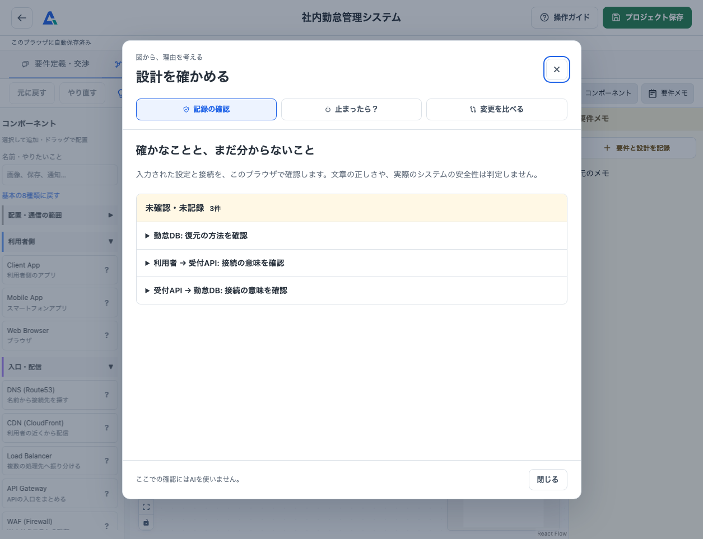
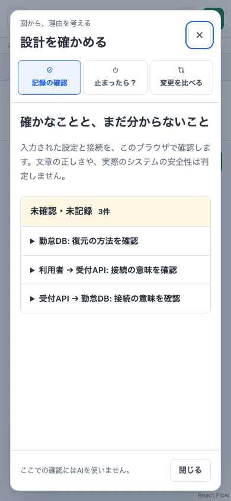

# Architecture Sandbox: 図を描く体験から、設計理由を説明する体験へ

2026-09-14〜15のローカル改善。**実装と自動検証の成果であり、学習効果や採用評価を実証したケースではない。**

## 取り組んだ問題

システム設計の練習アプリに部品とAI採点があっても、IT自体の初学者には「何を置くのか」「線で何を渡すのか」「なぜその構成なのか」が分かりにくい。操作ミスで作業を失ったり、点数を上げるために部品を足したりする体験では、アーキテクチャの意味を学びにくい。

既存画面とユーザーのレビューから、説明の密集、コンポーネント名より説明文が強い見出し、ヘルプ内の重要度の分かりにくさ、不要な注釈、スマホのパネル遮蔽、削除前のバックアップ導線不足が指摘された。このフィードバックは開発者本人からのもので、複数の初学者を対象にした調査結果ではない。

## 担当と制約

ユーザーが決めたこと: 対象はIT自体の初学者、学ぶ目的はアーキテクチャの大切さ、入口は当初自由設計、その後2026-09-15に「少ない部品からの体験学習」と「自由設計」の2つに変更、ライセンスはMIT。画面への具体的な修正指示と、実際に使って調整する進め方もユーザーによる。

Codexが行ったこと: 既存コードと仕様の調査、実装方針の具体化、UIと保存処理の変更、ローカル確認、テストと不具合修正、Issueと文書の整理。本稿はその記録であり、人がすべてのコードを手書きしたことや、独立した専門家のレビューを受けたことは主張しない。

制約は既存作業の保護、ローカル開発、追加AI料金の抑制、プロンプトインジェクションの境界維持。必須の講座や固定の正解図を導入せず、自由に試せる入口を残す。

## 主な判断と実装

| 改善前の問題 | 判断 | 改善後の体験 |
| --- | --- | --- |
| 説明が一覧に密集する | 選択と閲覧を別操作にし、説明は必要な時に開く | カード内の「？」でポップアップ。32種類を移動できる。本文だけスクロール |
| 技術名を知っていることが前提 | 役割と場面を先に説明する | 体験コースは2種類から開始。自由設計は全32種類・基本8種類への絞り込み、日本語検索、静的な接続例。重い図の描画処理をヘルプに追加しない |
| 新しいテーマごとにAIヒントが必要 | 回答ではなく共通の観点を用意する | 学ぶ／聞く／図にする／振り返るの任意ヒント。通信・入力挿入・隠し条件なし |
| 失敗から戻りにくい | 自動保存と可逆操作を基礎機能にする | Undo/Redo、保存状態、再開、削除前のJSON出力、保存失敗からの回復 |
| 囲みや台数が安全性の保証に見える | 見た目と意味を分離する | VPC/AZ/Subnetの明示参照、SGの関連付け、台数と切替・復元の別入力 |
| 接続が意味のない線になる | 渡すものと待ち方を記録する | 接続設定、短い線ラベル、同期／非同期、再試行の検討 |
| 条件と設計理由が結び付かない | 要件を手動で根拠と一組にする | 条件と根拠の記録、該当部品への参照、メモへの学習記録 |
| 点数だけで良否を判断する | 根拠・未知・仮定を区別する | ローカル確認、停止時の到達性、変更比較、AIの根拠リンクと共通の点数基準 |

データは旧形式を読めるようにし、新しい設定を含む保存だけv3とした。旧アプリが新情報を無言で捨てないための区別である。公開採点APIの形は変えず、追加情報を既存の部品詳細に含める。サイズが超過したら送信前に説明し、勝手に切り捨てない。

## 実際の画面

以下は架空の検証データを読み込んだローカル画面。図中の内容はユーザーの実データではない。

詳細は必要な項目だけ開く。図から確認した事実、未確認の項目、考える問いを別の色・見出しにし、色だけで意味を伝えない。閉じたら元の場所に戻り、背景のDeleteやUndoで図を壊さない。

## 検証したこと

自動テストでは、新旧のJSON往復、参照切れ、入力サイズ、保存失敗、再開、Undo/Redo、古い評価の共有防止、PC・スマホ・キーボード操作を確認した。追加したローカルの確認とヒントはAPI要求0件を確認。Backendは疑似AIを用いて正式条件と利用者入力の分離、応答検証、平均点の計算、エラーとリクエスト制限を確認する。

実画面の確認中、スマホのミニマップが部品を覆って操作できない問題を発見し、スマホでは表示しないよう修正した。どのテストが最終版で通ったかは[検証記録](ux-improvement-checklist.md#作業検証記録)を正とする。途中の失敗を成功件数に混ぜない。

新しい採点方式には[6ケースの評価セット](evaluation-fixtures.json)と、反復・差分・参照切れを測る[計測手順](evaluation-quality.md)を用意した。ただし固定応答のテストを実モデルの品質保証として扱わない。

## 言えることと言えないこと

言えること: 学習の説明を任意に開き、設計理由と接続を記録し、図の変化を確認しながら戻れる一連の操作をローカルで実装した。自由設計を維持し、新たな静的ヒント・確認機能のためのAI呼び出しは追加していない。

まだ言えないこと: 初学者が独力で完走する割合、別題材への応用、学習前後の改善量、実モデルの採点の安定性、専門家との一致率、本番環境の受入。利用者数や学習効果の数値は未測定。閲覧した採用担当者がどう評価するかも不明。

[初学者テストの台本](usability-study.md)を用意し、独力で説明できるかと別題材への応用を次の検証対象にした。[実AIの予備測定](evaluation-runs/2026-09-15/README.md)では32要求を取得し、不正JSONを拒否した記録と、生成Schema・採点指示の修正を残した。最終候補でも過大評価と意味上の誤参照が残るため、専門家の承認・品質受入・本番公開の判断は未完了としている。

## 振り返り

機能を増やすほど、初学者向けの画面は複雑になる。詳細を任意にするだけでは十分でなく、何を今確認したいかが分かる導線が必要だった。今後はフォーム数ではなく、利用者が設計理由を説明できた場面と、誤解した場面を根拠に削減・調整する。

AIで点数を出す機能と、良い学習体験は別の検証対象である。今回の実装ではAIの判定を万能に見せず、利用者の入力、図の計算、AIの推論、未確認を区別することを重視した。これが学習に役立つかは、実利用の記録で判断する。

## 2026-09-15: 学習コースの追加

ユーザーからのLearn Git Branchingを参考にした提案により、部品の役割を段階的に体験する入口を追加した。最初の2章では接続と要求・返事、アプリの一時記憶とDBへの保存を比較する。操作と役割の問いで学習の区切りを示し、自由設計へいつでも移れる。学習記録は既存プロジェクトと別に保存する。詳細・検証は[学習コースのチェックリスト](learning-course-plan.md)と[Issue #6](https://github.com/Morishita-mm/architecture-sandbox/issues/6)。実際の初学者による完走や理解の確認はまだ行っていない。

## 2026-09-15: 全8章への拡張

ユーザーが挙げた『システム設計の面接試験』の出版社公開目次を参考に、要求と保存から、見積もり・負荷分散・キャッシュ・キュー・利用制限・設計判断へつながる独自教材を追加した。改善する点だけでなく、DBの詰まり・古いコピー・二重通知・再試行も操作して比べる。最終章の図と記述を自由設計へ持ち込めるようにし、問いに正答することと自分で理由を説明することを分けた。

書籍本文や図の再現、公式教材、学習効果の実証ではない。旧2章の記録を残す移行と、AIを使わない教材の動作を検証した。最新の仕様・検証・画面は[8章のチェックリスト](learning-course-expansion.md)、作業管理は[Issue #7](https://github.com/Morishita-mm/architecture-sandbox/issues/7)。

## 2026-09-15: コンポーネント別のステージと練習

体験だけでは学んだ内容を確かめにくいという依頼を受け、基本8種類それぞれに独立した練習を用意した。操作結果と理由の確認で次を開放し、学習マップに部品の役割・到達目標・進捗を表示する。キューとWorkerを別ステージにし、受付と処理、重複防止を段階的に扱う。旧記録は残し、新しく追加した練習の達成を過去の体験から推定しない。

クリア済みの再挑戦で獲得済みの開放を取り消さず、経験者の自由設計への入口も維持する。8ステージと卒業課題を終えると修了一覧から図とメモを持ち込める。仕様・自己検証は[ステージのチェックリスト](component-stages.md)、作業管理は[Issue #8](https://github.com/Morishita-mm/architecture-sandbox/issues/8)。これはアプリ内の操作と練習の完了を示す実装であり、利用者が実際に習得した証拠は今後の実利用で集める。

### React Flowで学ぶ体験・練習への更新（2026-09-15）

各ステージに学習済みの部品だけ使える図を導入し、配置・接続・停止を教材の結果へ結び付けた。体験と練習の図は独立して保存し、卒業課題の実図を自由設計へ渡す。詳細と検証は [Issue #9の記録](interactive-course-canvas.md)、実画面は [キャプチャ](course-canvas-captures.md)。自動テストの完走は学習効果の証明ではなく、初学者の理解と別題材への応用は引き続き未検証。
